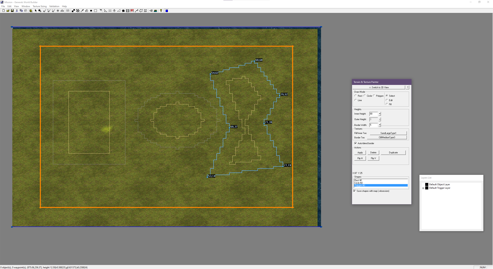
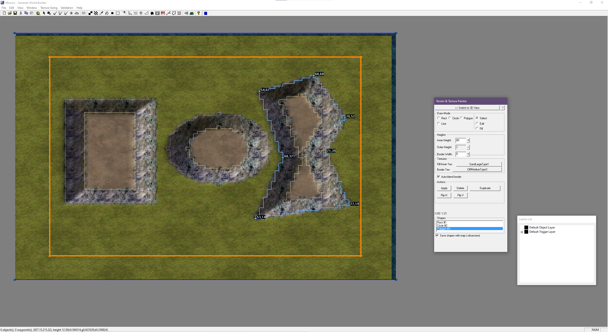
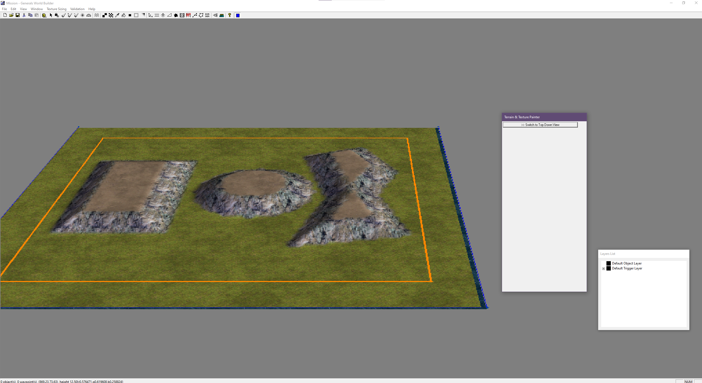
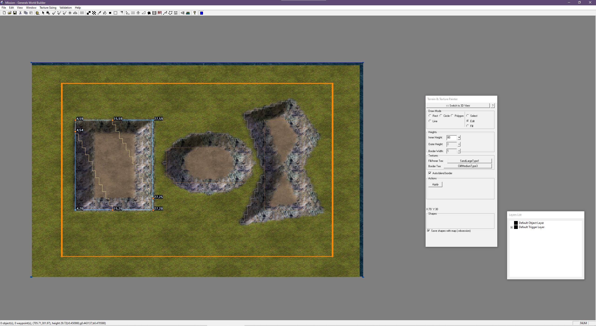
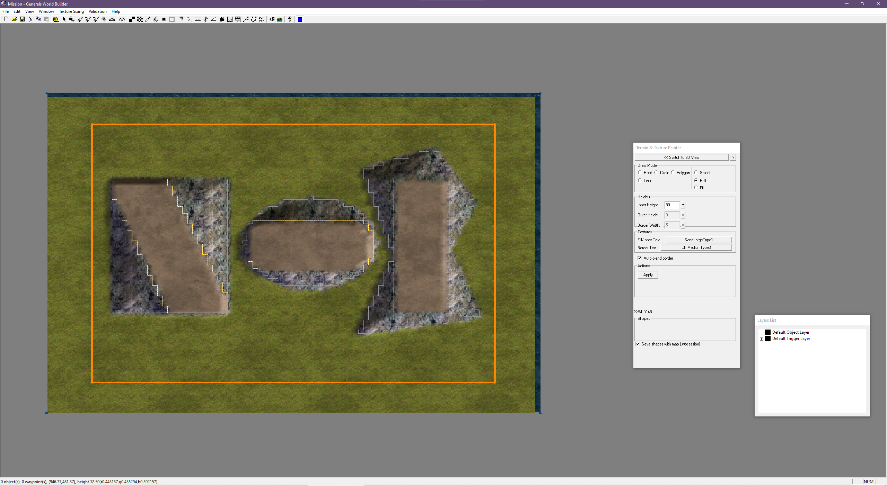
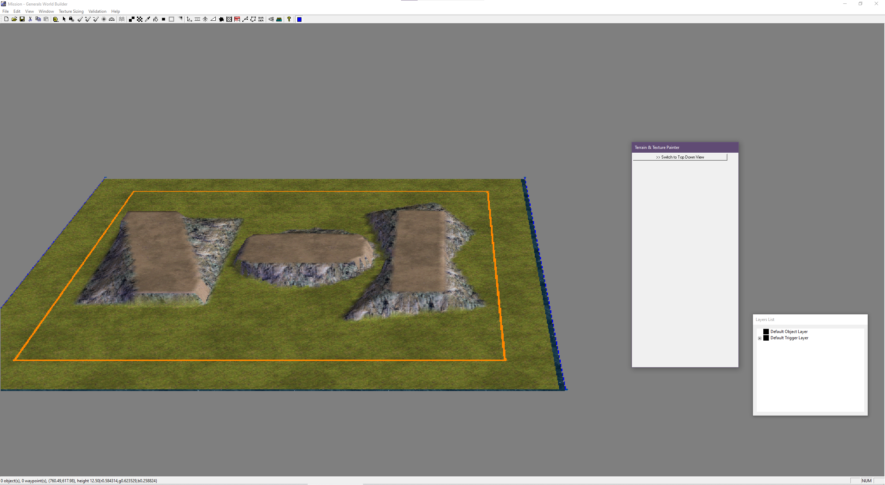
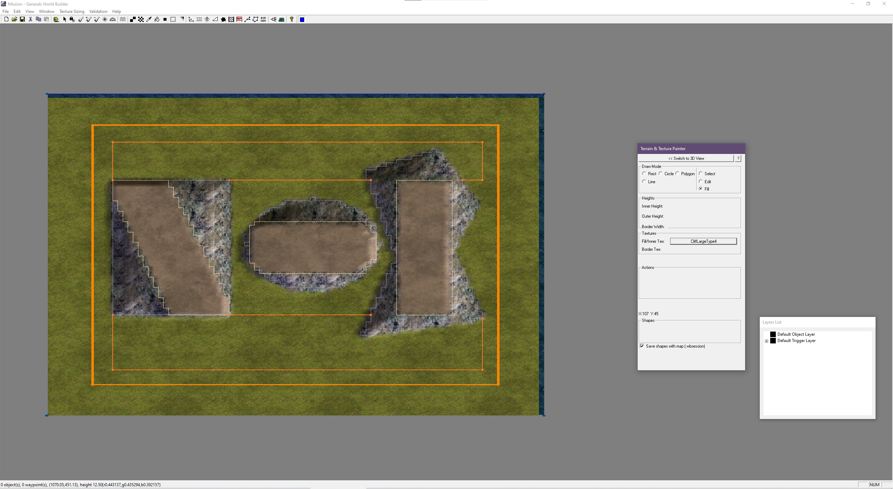
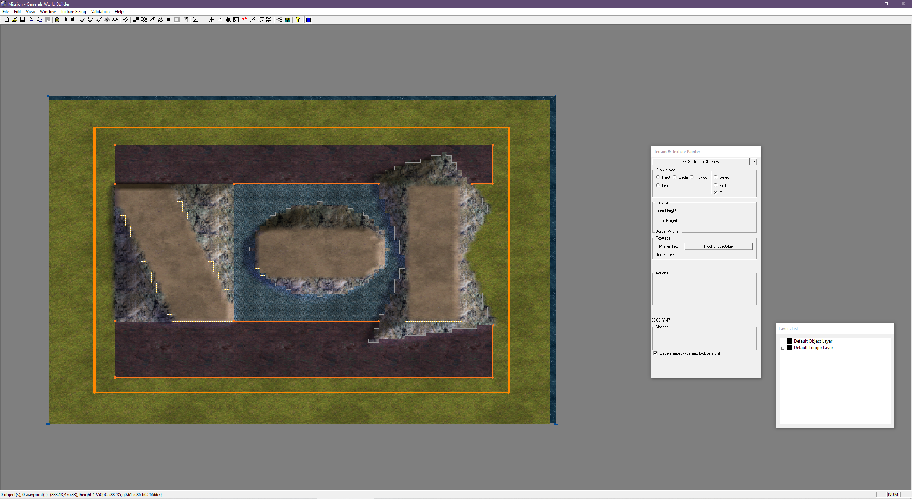
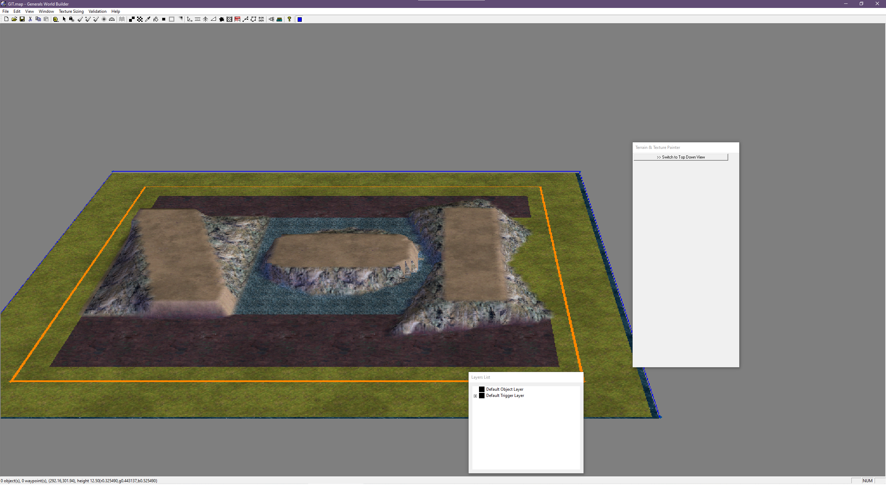

# WorldBuilder — Terrain & Texture Painter — How-To Guide

## Why does this exist?

WorldBuilder is powerful, but terrain editing is painful. Raising a hill means brushing tiles one by one, blending manually, and hoping the result looks intentional. Getting clean, precise shapes — a sharp plateau edge, a smooth crater, a cliff that's steep on one side and gradual on the other — takes a lot of trial and error and is nearly impossible to reproduce or adjust later.

What WorldBuilder always needed was something closer to a Photoshop workflow: draw a shape, fill it with a texture, fill it with a height. Define the outline first, worry about the details second. That idea is what the **Terrain & Texture Painter** grew out of.

With this tool you draw closed shapes — rectangles, circles, polygons — set a height and texture for the inside and the border ring, and hit Apply. The tool rasterizes the shape onto the tile grid and applies the height gradient in one step. The shape stays editable: move it, adjust the border width, drag individual inner polygon vertices to make asymmetric slopes, then Apply again. Undo/redo means you can experiment freely.

*First, draw your shapes — Rect, Circle, Polygon. Set height and texture, then hit Apply.*

*After Apply — inner texture, rocky border, and height gradient painted in one click.*

*The same result seen from the 3D perspective view.*

---

## Installation

### Quick install
Download `WorldBuilderZH.exe` from the [latest release](https://github.com/LijpePietje/ProjectWorldbuilder/releases/latest) and copy it to your C&C Generals Zero Hour installation folder — the same folder that contains `generals.exe` or `generalszh.exe`.

### Build from source
Clone the [GeneralsGameCode fork](https://github.com/LijpePietje/GeneralsGameCode/tree/feature/shapefill-tool) and follow the build instructions in that repository's README. Once built, copy `WorldBuilderZH.exe` to the same folder.

---

Start WorldBuilder — click the **blue square icon** in the toolbar to activate the tool. The **Terrain & Texture Painter** panel appears on the right.

---

## The Panel

When the tool is active, the **Terrain & Texture Painter** panel shows two columns of mode buttons:

| Left column — **Create** | Right column — **Manipulate** |
|---|---|
| Rect | Select |
| Circle | Edit |
| Polygon | Fill |
| Line | |

Below the mode buttons: height settings, texture pickers, border width, and action buttons.

---

## Golden Path — a hill in 4 steps

1. Select **Rect**, drag a rectangle on the map  
   *(hold left mouse button, release to finish)*

2. Set **Inner Height = 20**, **Outer Height = 0**, **Border Width = 8**  
   *(click the popup arrows next to each field)*

3. Pick a texture — click **Inner Tex** and choose from the terrain picker

4. Click **Apply** → the hill appears in the terrain

That's it. The shape stays selected so you can adjust settings and Apply again.

---

## Create tools

### Rect
Draw a rectangular shape by dragging. Snaps to the tile grid.  
Best for: flat plateaus, box craters, simple hills.

### Circle
Draw a circular shape by dragging from center outward. Rendered as a staircase on the tile grid (matches how the engine works).  
Best for: round hills, bomb craters, circular clearings.

### Polygon
Click to place vertices, **right-click** to close the polygon.  
Best for: irregular terrain features, cliffs, river banks.

> **Tip:** The polygon outline snaps to the tile grid (corner grid) and draws as staircases — what you see is exactly what gets applied.

### Line
Click two endpoints to place a line. Endpoints are draggable in **Select** mode.  
Use lines as barriers for **Fill** mode — draw an enclosed area, then flood-fill it.

---

## Manipulate tools

### Select
- Click a shape to select it (highlights in yellow)
- **Drag** to move the shape
- **Apply** — paint the shape's height and texture onto the terrain
- **Duplicate** — copy the selected shape, offset 10 tiles, select the copy
- **Flip H** — mirror the shape horizontally; **Flip V** — mirror vertically. Useful for building symmetric maps: make one half, duplicate it, flip, position it opposite
- **Delete** — remove the selected shape
- The **Shapes list** at the bottom shows all shapes — click to select

### Edit
The powerful one. Exposes individual vertices of the **inner polygon** as orange diamond handles.

By default the inner polygon is a uniform inset of the outer shape. In Edit mode you can drag each point independently — making one side steep and the other gradual, or any asymmetric slope you want.

**How to use:**
1. Place a shape, switch to **Edit** mode
2. Orange diamonds appear on the inner polygon
3. Drag a diamond — that corner of the slope moves independently
4. Click on an **inner edge** (between two diamonds) → inserts a new vertex, drag immediately
5. Click on an **outer edge** (the shape outline) → inserts a new outer vertex

> **Reset inner polygon:** adjust the **Border Width** slider — this clears the free-edited inner polygon and returns to a uniform inset.

*Edit mode — orange diamond handles visible on each shape's inner polygon.*

*After Apply — the distorted inner polygons produce irregular, asymmetric height gradients.*

*3D view of the same result — each shape has a unique slope profile.*

*Lines drawn to divide the map into separate areas, ready for flood fill.*

*Each enclosed area filled independently with a different texture.*

*The same result from the 3D perspective view.*

### Fill
Flood-fill an enclosed area from a click point.  
Draw lines or place shapes to enclose a region, then click inside with Fill to paint the entire area with the selected texture and height.

> The fill recognizes inner perimeters as barriers — so the inner zone and the border ring can be filled independently.

---

## Height settings

| Setting | Effect |
|---|---|
| **Inner Height** | Height of the inner zone (top of a hill, bottom of a crater) |
| **Outer Height** | Height at the outer edge (ground level) |
| **Border Width** | How many tiles wide the gradient slope is |

The gradient runs from Outer Height at the shape edge to Inner Height at the inner polygon edge.

> **Apply stacks:** clicking Apply multiple times adds height on top of height. If you want to redo, use **Ctrl+Z** to undo first.

### Auto-blend border
The **Auto-blend** checkbox enables texture blending on the outer edge. Reduces the hard cutoff where the shape meets the surrounding terrain — useful for organic-looking slopes.

---

## Undo / Redo

- **Ctrl+Z** — undo the last shape operation
- **Ctrl+Y** — redo

Every action is undoable: Apply, move, Edit vertex drag, Duplicate, Delete, Flip, polygon close.

---

## Workflow tips

- **Duplicate** copies the selected shape and places it 10 tiles away — faster than recreating
- **Flip H / Flip V** mirrors the shape including its inner polygon — useful for symmetric maps
- **Shapes list** (in Select mode) — click any entry to re-select a shape you made earlier
- **Save with map** — shapes are saved as `mapname.wbsession` next to the `.map` file and reloaded automatically

---

## Example: asymmetric cliff

1. Place a **Polygon**, trace a cliff edge
2. Set **Inner Height = 15**, **Outer Height = 0**, **Border Width = 12**
3. Switch to **Edit** mode — orange diamonds appear on the inner polygon
4. Drag the diamonds on the steep side inward (narrow border) and the gentle side outward (wide border)
5. Click **Apply** — the cliff is steep on one side and gradual on the other

---

## Keyboard shortcuts

| Key | Action |
|---|---|
| Ctrl+Z | Undo |
| Ctrl+Y | Redo |
| Del | Delete selected shape |
| Right-click (2D view) | Close polygon / commit line |

---

## Known limitations

- Shapes are stored per map file (`.wbsession`) — they are not embedded in the `.map` file itself
- The tool only works in **2D top-down view** — switch with the "Top-Down View" button in the panel if needed
